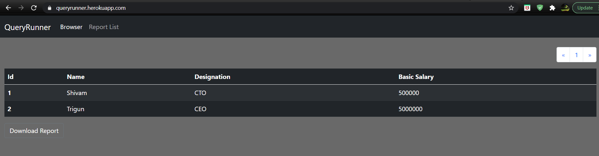

# queryRunner

## Features

- Can create custom report
- Save custom report
- Can see result of custom report query any time
- Can download the report as excel file

## Dev ENV
- Clone Repo
- Open CLI run npm install
- run npm start
- Open browser and go to localhost:5667

## Some Screen shots of app

